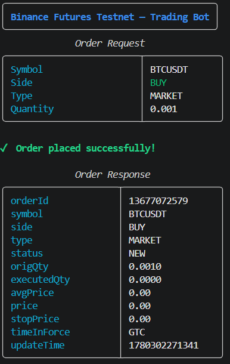
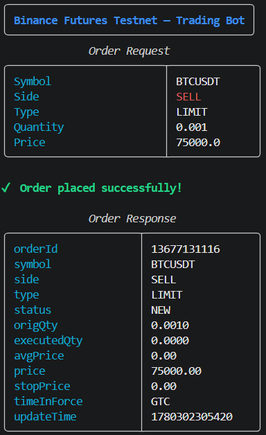
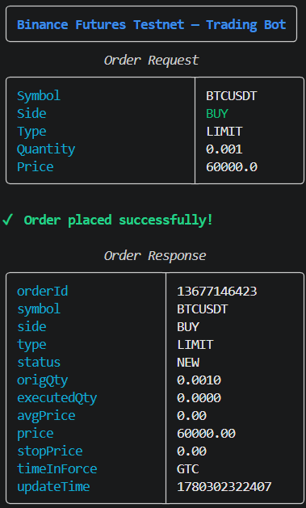
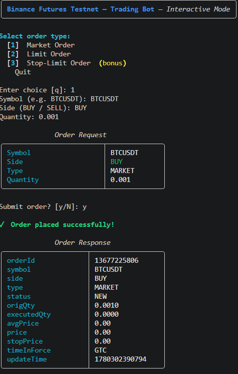
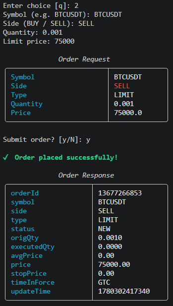
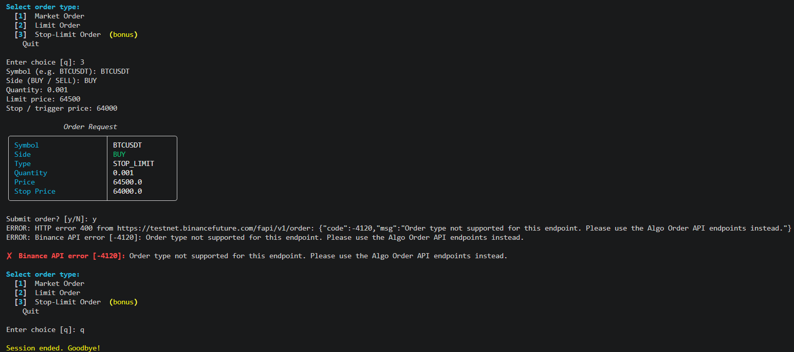
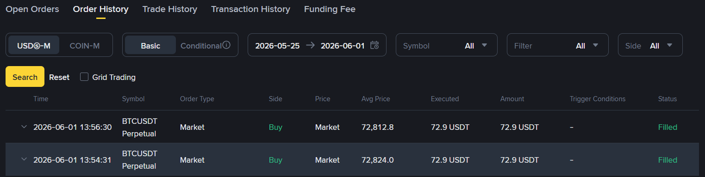
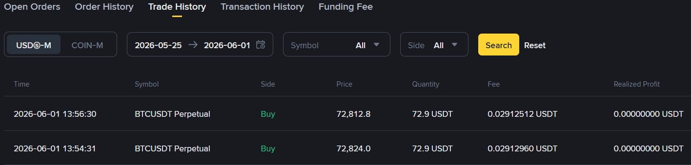
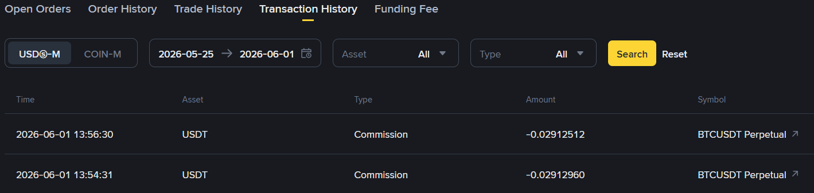

# Binance Futures Testnet Trading Bot

A lightweight Python CLI application for placing orders on the **Binance USDT-M Futures Testnet**.

---

## Features

| Capability | Details |
|---|---|
| Order types | Market · Limit · **Stop-Limit** (bonus) |
| Sides | BUY · SELL |
| CLI | `typer`-powered with `rich` terminal output |
| Interactive mode | Menu-driven session (bonus) |
| Logging | Rotating file logs, DEBUG to file / WARNING to console |
| Error handling | Validation errors · Binance API errors · Network failures |

---

## Project Structure

```
trading_bot/
├── bot/
│   ├── __init__.py          # package init, re-exports setup_logging
│   ├── client.py            # Binance REST client (auth, signing, HTTP)
│   ├── orders.py            # order-placement logic
│   ├── validators.py        # input validation
│   └── logging_config.py   # logging setup
├── cli.py                   # CLI entry point (Typer)
├── logs/
│   └── trading_bot.log      # all runs logged here (auto-created)
├── screenshots
├── .env.example
├── requirements.txt
└── README.md
```

---

## Screenshots

### Market Order


### Limit Order



### Interactive Mode




### Testnet Order History




---

## Setup

### 1. Get Testnet API Credentials

1. Visit [https://testnet.binancefuture.com](https://testnet.binancefuture.com).
2. Log in with GitHub (no email registration needed).
3. Click **API Key** in the top menu → copy your key and secret.

### 2. Clone the Repository

```bash
git clone https://github.com/your-username/trading-bot.git
cd trading-bot
```

### 3. Create a Virtual Environment

```bash
python -m venv venv
venv\Scripts\activate      #windows
```

### 4. Install Dependencies

```bash
pip install -r requirements.txt
```

### 5. Configure Credentials

`.env` contents:

```
BINANCE_API_KEY=your_testnet_api_key
BINANCE_API_SECRET=your_testnet_api_secret
```

---

## How to Run

### Place a Market Order

```bash
python cli.py place --symbol BTCUSDT --side BUY --type MARKET --quantity 0.001
```

### Place a Limit Order

```bash
python cli.py place --symbol BTCUSDT --side SELL --type LIMIT --quantity 0.001 --price 75000
```

> For SELL limit orders the price must be **above** current market price.  
> For BUY limit orders the price must be **below** current market price.

### Place a Stop-Limit Order *(bonus)*

```bash
python cli.py place --symbol BTCUSDT --side BUY --type STOP_LIMIT --quantity 0.001 --price 64500 --stop-price 64000
```

`--stop-price` is the **trigger price**; `--price` is the **limit price** used once triggered.

### Interactive Mode *(bonus)*

```bash
python cli.py interactive
```

Presents a numbered menu, prompts for all fields with inline validation, and asks for confirmation before submitting.

### Help

```bash
python cli.py --help
python cli.py place --help
```

---

## Example Output

```
╭───────────────────────────────────────╮
│ Binance Futures Testnet — Trading Bot │
╰───────────────────────────────────────╯
              Order Request               
╭─────────────────────────┬──────────────╮
│ Symbol                  │ BTCUSDT      │
│ Side                    │ BUY          │
│ Type                    │ MARKET       │
│ Quantity                │ 0.001        │
╰─────────────────────────┴──────────────╯

✓  Order placed successfully!

              Order Response              
╭─────────────────────┬──────────────────╮
│ orderId             │ 13676060993      │
│ symbol              │ BTCUSDT          │
│ side                │ BUY              │
│ type                │ MARKET           │
│ status              │ NEW              │
│ origQty             │ 0.0010           │
│ executedQty         │ 0.0000           │
│ price               │ 0.00             │
│ timeInForce         │ GTC              │
│ updateTime          │ 1780301454806    │
╰─────────────────────┴──────────────────╯
```

---

## Logging

All runs append to `logs/trading_bot.log` (auto-created on first run, rotating at 10 MB × 5 backups).

```
2025-06-01T10:23:44 | INFO     | trading_bot.orders | Placing order — type=MARKET side=BUY symbol=BTCUSDT qty=0.001
2025-06-01T10:23:44 | DEBUG    | trading_bot.client | REQUEST POST https://testnet.binancefuture.com/fapi/v1/order  params={... 'signature': '***'}
2025-06-01T10:23:44 | DEBUG    | trading_bot.client | RESPONSE 200  body={...}
2025-06-01T10:23:44 | INFO     | trading_bot.orders | Order accepted — orderId=13676060993 status=NEW executedQty=0.0000
```

---

## Assumptions

- **Testnet only.** The base URL is hardcoded to `https://testnet.binancefuture.com`. To target production, pass a different `base_url` to `BinanceFuturesClient`.
- **Order status on testnet.** Market orders return `status: NEW` on the testnet (rather than `FILLED`) as testnet does not fully simulate order matching.
- **One-way / BOTH position mode.** The bot does not set `positionSide`; Binance defaults to `BOTH` (one-way mode) on testnet accounts.
- **Precision.** Quantity and price are forwarded as-is. If Binance rejects an order for precision/step-size reasons, it will surface the API error message.
- **No order management.** This bot only *places* orders. Querying, cancelling, or tracking open orders is out of scope.
- **Stop-Limit on testnet.** Binance Futures Testnet routes `STOP` orders through a separate Algo API not available on standard testnet accounts (error -4120). The implementation is correct for production; this is a testnet-only restriction.
- **STOP_LIMIT mapping.** The user-facing type `STOP_LIMIT` maps to Binance Futures `type=STOP`, which is a stop-limit order (requires both `stopPrice` and `price`).

---

## Dependencies

| Package | Purpose |
|---|---|
| `httpx` | HTTP client (async-ready, modern) |
| `typer[all]` | CLI framework |
| `python-dotenv` | `.env` credential loading |
| `rich` | Terminal tables and styling |